# 1. ELK Stack Nedir?
ELK Stack üç tane açık kaynak kodlu ürünün (Elasticsearch, Logstash ve Kibana) birleşimidir. ELK Stack dünyanın en popüler log yönetim programlarından birisidir. ELK Stack iş zekası, güvenlik, uyum ve web analitiği alanlarında en çok kullanılan araçlardan birisidir. Logstash logları toplar ve ayrıştırır, sonrasında Elasticsearch bu logları endeksler ve saklar. Kibana ise görsel bir şekilde bu logları kullanıcılara sunar.
## 1.1. Elasticsearch
Elasticsearch çoğu zaman bir arama sunucusu olarak da anılmaktadır. Normalde insanlar arama işlevini kendilerinin yaptıkları basit bir işlem olarak görürler. Oysa ki arama işlemi çok karmaşık bir işlem olup bizlere hizmet olarak sunulmaktadır. Elasticsearch bu hizmeti sunan arama sunucularından bir tanesidir. Fakat bildiğimiz SQL veritabanlarından farklı olarak veriyi belirli bir düzen içerisinde tutmaz. Elasticsearch verinin ne kadar düzenli tutulduğundan çok aramalara karşı ne kadar iyi performansa sahip olduğuna önem verir.
## 1.2. Logstash
Logstash ELK Stack’in tam ortasında bulunan olmazsa olmaz parçalardan biridir. Elasticsearch verileri ne kadar iyi endekslerse endekslesin, bu verilerin öncelikle bir yerden ELK sunucusuna gelmesi gerekmektedir. Çeşitli kaynaklardan bu verilerin gelmesi işlemini Logstash gerçekleştirmektedir. Yani kısaca Logstash çeşitli uygulama ve sunuculardan logları alıp Elasticsearch e saklaması için iletmektedir.

Bunlardan farklı olarak Logstash ayrıca veriyi filtreleme ve şekillendirme görevini de yerine getirmektedir. Bu sayede gelen veriler anlamlandırılmakta ve kullanıcının kolayca anlayabileceği bir hale gelmektedir.
##1.3. Kibana
Her sistemde olduğu gibi ELK Stack için de görsellik çok önemlidir. Kibana ELK Stack’de tutulan logların görselleştirilmesi görevini üstlenmektedir. Kibana ile loglar kategorilere göre ayırılabilmekte, belirli kriterlere göre daraltılabilmekte ve istenilen formatta görsel grafikler şeklinde kullanıcıya gösterilebilmektedir.
# Çalışma Prensipleri
## 2.1. Elasticsearch
### 2.1.1. Terminoloji
Elasticsearch arama işlemini kolaylaştırmak ve verileri düzenli bir şekilde tutabilmek için farklı bir mimari yapı kullanmaktadır. Bu yapıda en üstte dizi (cluster) gelmektedir. Dizi bir veya daha fazla düğümün (node) birleşmesinden oluşan ve tüm bu düğümler arasında endeksleme ve arama yetenekleri sağlanan birimdir. Düğüm ise verileri saklayan tek bir sunucudur. Bir düğüm istenilen diziye ait olacak şekilde ayarlanabilmektedir. Endeks (index) benzer özellikler içeren dökümanların birleşiminden oluşmaktadır. Farklı veri kategorileri için farklı endeksler oluşturabilmek mümkündür. Tip (type) benzer yapı içeren verilere verilen genel bir yapıdır. Döküman (document) ise endekslenebilen en temel bilgi birimidir.

Bir endeksteki verilerin boyutu çok büyük olabileceği için, donanımsal problemler yaşamamak adına endeksteki veriler zarflara (shards) ayırılmaktadır. Bu sayede içerik hacmi yatay olarak ayrılırken aynı zamanda bir arama işlemi zarflar üzerinde paralel olarak gerçekleştirilebilmektedir. Sistemde beklenmeyen problemlerin yaşanması durumlarda veri kaybı yaşamamak için bu zarfların kopyaları (replicas) da ayrıca tutulabilmektedir. Bu kopyaların sayısı her bir endeks için kullanıcılar tarafından ayarlanabilmektedir.
### 2.1.2. Kurulum
Bu çalışma kapsamında anlatılan bütün kurulumlar CentOS 7 üzerinde yapılacaktır. Ayrıca makine kurulurken ‘Server with GUI’ seçeneği seçilmelidir. Bu seçeneğin seçilmesi gerekli olan pek çok kütüphane ve uygulamanın yüklü olarak gelmesini sağlayacaktır (örn. Java, EPEL repository). 
* Öncelikle GPG imza anahtarını indirip yükleyiniz:
```sh
rpm –import https://packages.elastic.co/GPG-KEY-elasticsearch
```
* Elasticsearch’ün yüklenebilmesi için gerekli olan repo dosyasını aşağıdaki gibi oluşturunuz ve elasticsearch.repo olarak /etc/yum.repos.d klasörü altına kaydediniz:


* Oluşturduğunuz repo dosyasını kullanarak elasticsearch’ü yükleyiniz:
```sh
yum -y install elasticsearch
```
* Elasticsearch’ün sistem açılışında servis olarak çalışması için aşağıdaki komutları çalıştırınız:
```sh
systemctl daemon-reload
systemctl enable elasticsearch.service
systemctl start elasticsearch.service
```
* Elasticsearch’ün düzgün çalışıp çalışmadığını kontrol etmek için aşağıdaki komutu çalıştırabilirsiniz. Çıkan sonuçta elasticsearch versiyonunu, dizi adını (varsayılan olarak elasticsearch) ve diğer varsayılan değerleri görebilirsiniz.

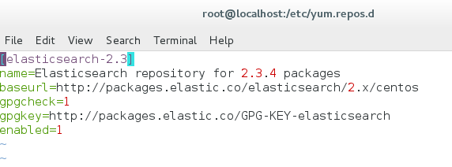

### 2.1.3. Konfigürasyon
Elasticsearch konfigürasyon dosyaları /etc/elasticsearch/conf dizini altında bulunmaktadır. Bu dizin altında elasticsearch.yml ve logging.yml dosyaları bulunmaktadır. Genel olarak elasticsearch ayarları elasticsearch.yml dosyası üzerinden yapılmaktadır. Logging.yml dosyası ise Elasticsearch loglama ayarlarını içermektedir. Elasticsearch.yml dosyası uzantısından da anlaşılacağı üzere yaml formatında yazılmıştır. Buradaki alanlardan en çok kullanılanlar veya değiştirilmesi gerekenler aşağıda listelenmiştir.
Path.log, path.plugin, path.conf: logların, pluginlerin ve konfigürasyon dosyalarının hangi dizin altında olduğunu gösterir.
Cluster.name, node.name: Dizi ve düğümün isminin girilebilmesini sağlar. Verilmezse elasticsearch varsayılan değerlerden atamaktadır.
İndex.number_of_shards, index.number_of_replicas: Bir endeks için zarf ve kopya sayısının girilebilmesini sağlar. Varsayılan olarak zarf sayısı 5 ve kopya sayısı 1’dir.
Plugin.mandatory: Bir düğümün çalışması için yüklenmesi zorunlu olan pluginlerin belirtilmesini sağlar. Eğer burada yazan bir plugin yüklü değilse o düğüm başlayamaz.
Network.host: Diğer düğümlerin bu düğümle konuşmak için kullanacağı ve bind adresi olan IP adresinin belirtilmesini sağlar.
Transport.tcp.port: Düğümler arası iletişimde kullanılacak port numarasını belirtir. Varsayılan olarak 9300’dür.
http.port: http trafiğinin dinleneceği port numarasını belirtir. 
http.enabled: false verildiğinde http’nin olarak kullanılmamasını sağlar.
Logging.yml Elasticsearch için loglama ayarlarını içerir. Genel olarak logging.yml hakkında bilinmesi gereken logger.level alanındaki değerdir. Bu değere bağlı olarak elasticsearch loglama seviyesi belirlenir. Bu değer ERROR, WARN, INFO, DEBUG ve TRACE değerlerinden herhangi biri olabilir. Varsayılan olarak INFO seçilidir, fakat daha fazla log istendiğinde DEBUG veya TRACE seçilebilir, aynı şekilde sadece hatalar gösterilmek istendiğinde ERROR olarak seçilebilir.

### 2.1.4. Elasticsearch REST API
ELK Stack kurulum ve yönetimi için çok gerekli olmasa da, oluşabilecek hataları çözebilmek ve Elasticsearch i ayrı olarak kullanabilmek için API’lerini öğrenmek faydalı olacaktır. Elasticsearch REST API  genel olarak endeks ve doküman ekleme, çıkarma ve değiştirme işlemleri için ve dizilerin durumlarını ve istatistiklerini kontrol edebilmek için kullanılmaktadır. Ayrıca REST API ile beraber arama, filtreleme, sıralama gibi daha pek çok fonksiyon yerine getirilebilmektedir. Bu çalışma kapsamında, REST API ile yapılabilecek belli başlı temel fonksiyonlar aşağıda örneklendirilmiştir:

* Elasticsearch’de bulunan dizilerin durumunu öğrenmek için ```curl ‘localhost:9200/_cat/health?v’``` komutu çalıştırılabilir. Çıkan sonuçta yeşil (green) herhangi bir sorun olmadığını, sarı (yellow) verilerin tamamen operasyonel olduğunu fakat bazı kopyaların henüz ayrılmadığını, kırmızı (red) ise bazı verilerin erişilebilir olmadığını ifade etmektedir. Ayrıca çıkan cevapta kaç tane düğüm ve zarf olduğunu da görebilirsiniz.

* Elasticsearch’de dizide bulunan düğümlerin listesini öğrenmek için ```curl ‘localhost:9200/_cat/nodes?v’``` komutu çalıştırılabilir. Aynı şekilde tüm endeksleri listelemek için curl ‘localhost:9200/_cat/indices?v’ komutu çalıştırabilir.

* Komut satırından yeni bir endeks oluşturmak için ```curl -XPUT ‘localhost:9200/endeksAdi?pretty’``` komutu çalıştırılabilir.

* Var olan bir endekse yeni bir doküman eklemek için
```sh
curl -XPUT ‘localhost:9200/endeksAdi/tipAdi/1?pretty -d ‘
{
	“alanAdi”: “değeri”
}’
```
şeklinde komut girilebilir. Doküman üzerinde değişiklik yapılmak istendiğinde aynı komut istenilen değerlerle birlikte tekrar çalıştırılabilir. Burada ayırt edici unsur id değeri yani bu örnek için 1’dir. Id değeri 1 olarak girilen tüm komutlar bu doküman üzerinde değişiklik yapacaktır, fakat id değeri 2 olarak girilen başka bir komut yeni bir doküman oluşturacaktır. Bu dokümana da ulaşmak için ```curl -XGET ‘localhost:9200/endeksAdi/tipAdi/2?pretty’``` komutu çalıştırılabilir.

* Var olan bir endeksi komut satırından silmek için ```curl -XDELETE ‘localhost:9200/endeksAdi?pretty’``` komutu çalıştırılabilir.

* Var olan bir dokümanı komut satırından silmek için ```curl -XDELETE ‘localhost:9200/endeksAdi/tipAdi/id?pretty’``` komutu çalıştırılabilir.

* Dokümanları elle girmek yerine tek bir komut satırıyla bir dosyadan endekslenmek istediğinde ```curl -XPOST ‘localhost:9200/endeksAdi/tipAdi/_bulk?pretty’ --data-binary “@fileName.json”``` komutu çalıştırılabilir. Dosyanın json formatına sahip olduğu önceden kontrol edilmelidir.

* Bir endeksteki tüm dokümanları getirmek için
```sh
curl ‘localhost:9200/endeksAdi/_search?q=*&pretty’
```
komutu veya
```sh
curl -XPOST ‘localhost:9200/endeksAdi/_search?pretty’ -d ‘
{
	“query”: { “match_all”: {}}
}’
```
komutu çalıştırılabilir.

* Üstteki komutta geçen query kısmı, dokümanların istenilen alanlarının istenilen filtreden geçirildikten sonra getirilebilecek şekilde değiştirilebilmektedir. Bu işlemlerin nasıl yapılacağı Elasticsearch’ün sitesinden bulunabilir.

### 2.1.5. Örnek Kullanım Senaryosu

Bu kısımda daha önceki Kurulum ve REST API kısımlarında sağlanan bilgiler ışığında basit bir örnek canlandırılacaktır. 

Öncelikle Elasticsearch için aşağıdaki gibi basit bir durum kontrolü yapalım.

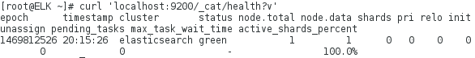

Gelen cevaptan da anlaşılacağı üzere elasticsearch isimli dizi yeşil yani çalışır durumda. Ayrıca bu dizimizin içerisindeki düğümlerin listesini de getirelim.

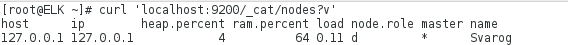

Son olarak da Elasticsearch içerisinde bulunan endekslerin bir listesini getirelim.
 

 
Henüz kurulumdan sonar bir şey eklemediğimiz için gelen cevaptan da anlaşılacağı üzere Elasticsearch üzerinde herhangi bir endeks bulunmamaktadır.

Daha önce bahsedildiği gibi Elasticsearch birden fazla endekse sahip olabilir ve bu endekslerin altında birden fazla tip olabilir. Her bir tip için de birden fazla doküman denilen kayıtlar bulunabilir. Buradaki öğrenciler ile ilgili bilgileri barındıran bir okul endeksi kuracağız. Bu endeksin altında da ogrenci tipinde dokümanlar oluşturacağız. Bunun için oluşturmuş olduğumuz json formatındaki dosyayı elasticsearch e yeni bir endeks olarak aşağıdaki gibi yüklüyoruz.

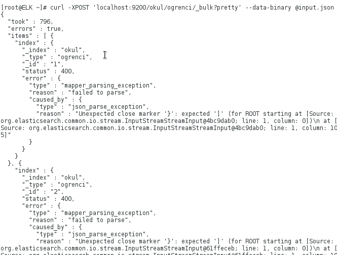

Düzgün bir şekilde yüklenip yüklenmediğini kontrol etmek için dokümanlardan bir tanesini çekelim.

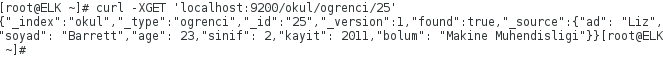

Çıkan sonuçtan da görüleceği üzere her bir ogrenci dokümanı ad, soyad, yaş, sınıf, kayıt tarihi ve bölüm bilgilerinden oluşmaktadır. Verilerimizin elasticsearch de düzgün bir şekilde tutulduğundan emin olduktan sonra bir sonraki işlemimiz bu veriler üzerinde arama yapmak. Öncelikle soyadı Hester olan öğrencilerin kayıtlarını getirelim.

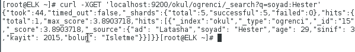

Yukarıda görüleceği üzere q parametresi alan adı ve değerini alarak bunlar için sorgulama yapmaktadır. Fakat ileri seviye aramaların q parametresi ile yapılabilmesi gerçekten çok zor, bu yüzden elasticsearch DSL (Domain-Specific Language) dilinde aramalar yapabilmeyi mümkün kılmıştır. Örneğin yukarıda yaptığımız aramanın aynısını şu şekilde yapmamız da mümkündür.

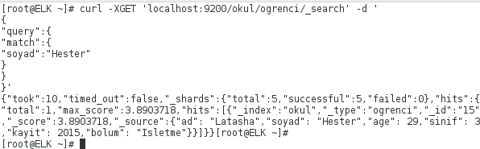

Görüleceği üzere iki arama da aynı sonuçları getirdi. Bu örnek için DSL kullanımı gereksiz gibi dursa da, ismi Susanna olan ve yaşı 20 den büyük olan kişileri aramak istediğimiz de DSL in ne kadar önemli olduğunu anlıyoruz. Bahsettiğimiz aramayı şimdi DSL ile yapalım.

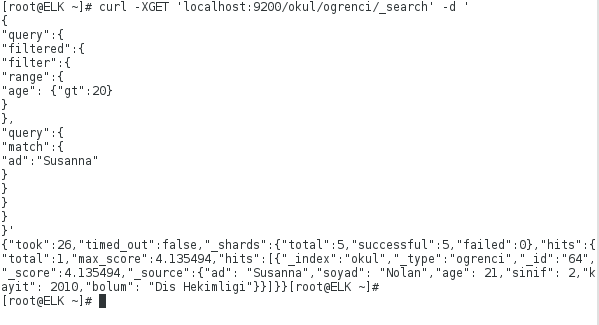

Yukarıdaki aramada yazılan range filtresi belirli bir aralık için arama yapılırken kullanılmaktadır. Daha önce de kullandığımız match ise direk bir eşleşme aramaktadır.

Şimdi ise mühendislik okuyan öğrencilerin kaydını getirmeye çalışalım. Bunun için birden fazla bölüm olduğu için, direk bölüm alanında mühendis ifadesini içeren kayıtları getirelim.

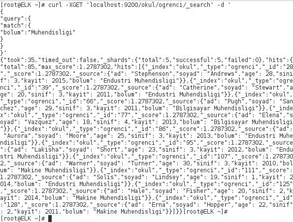

Görüldüğü gibi bu şekilde mühendislik bölümlerinde okuyan öğrencilerin kayıtlarını getirmiş olduk. Bu aramada öncekilerden farklı olarak bolum alanında muhendis ifadesi içeren tüm kayıtlar getirildi. Buradaki _score alanı aratılan ifadenin alan içerisinde ne kadarının eşleştiğinin normalize edilmiş halidir. Şimdi sadece Bilgisayar mühendisliği bölümünde okuyan öğrencilerin kayıtlarını getirmeye çalışalım.

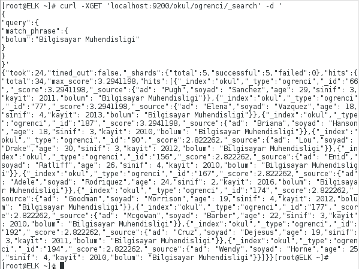

Görüleceği üzere Bilgisayar Mühendisliği ifadesi iki kelime içerdiği için match filtresi değil onun yerine match_phrase filtresi kullanıldı.

Şimdiye kadar elasticsearch üzerinde bulunan bir endekste kayıtlı dokümanlar üzerinde arama ve filtreleme işlemi nasıl yapılır onlara değindik. Şimdi ise elasticsearch’ün tercih edilme sebeplerinden birisi olan analiz yeteneğini biraz inceleyelim. Elasticsearch, SQL’deki GROUP BY özelliği gibi birleştirme (aggregation) özelliğine sahiptir. Bu özelliği kullanmak için şimdi okulda kayıtlı öğrencilerin kaçının hangi bölümde okuduğunu öğrenmeye çalışalım.

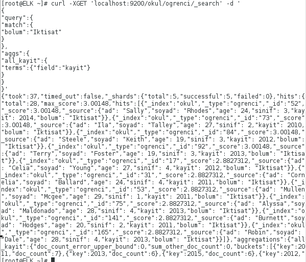

Gelen cevabın alt satırlarına bakıldığında örneğin iktisat bölümünde toplam 28 öğrenci bulunmaktadır. Bu aramamızı geliştirerek Iktisat bölümünde okuyan öğrencilerin kayıt yılına göre sayılarına bakalım.

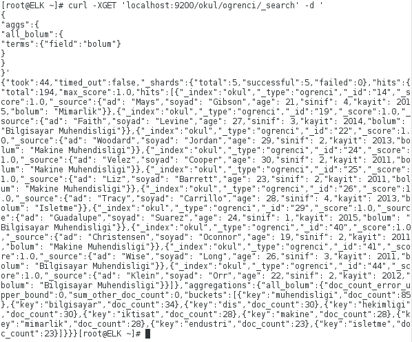

Yine gelen cevabın alt satırlarına bakıldığında örneğin 2015 yılında kayıt olmuş İktisat bölümünde okuyan öğrenci sayısı altıdır. Bu şekilde birleştirme işlemi sadece belirli bir kriteri sağlayan kayıtlar üzerinden de yapılabilmektedir. Şimdi biraz daha farklı bir örnek yapalım ve her bir bölümdeki öğrencilerin ortalama yaşına bakalım.

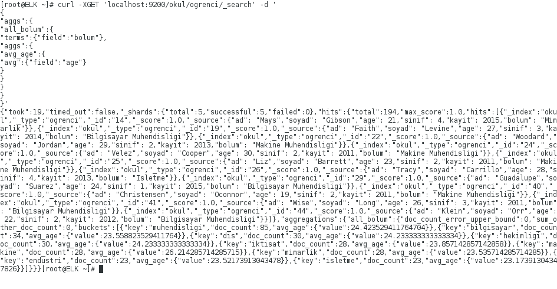

Bu kısımda bahsettiğimiz örnekler Elasticsearch ile yapılabileceklerin sadece ufak bir kısmıydı. Fakat, elasticsearch ile karmaşık aramaların ne kadar hızlı bir şekilde yapılabildiğinin ve nasıl yapıldığının bir gösterimi olarak düşünülebilir. Daha detaylı aramaların nasıl yapılabileceği ve aramalarda kullanılan DSL dilinin yazım biçimleri için elastic.co sayfasına bakabilirsiniz.

## 2.2. Logstash
Logstash gerçek zamanlı veri toplama motorudur. Pek çok farklı kaynaktan topladığı verileri birleştirip istenilen hedef konuma kaydedebilmektedir. Herhangi bir yapıya sahip veri Logstash filtre ve output pluginleriyle istenildiği gibi işlenebilmektedir. Logstash sayesinde istenilen türe sahip loglar toplanabilmekte ve ayrıca çeşitli pluginler aracılığıyla bilgisayar üzerinde gerçekleşen pek çok olayın kayıtları tutulabilmektedir. 

Belirli bir verinin logstash ile toplanabilmesi için, Logstash bir veya daha fazla input, filter veya output plugini kullanmaktadır. Bunlardan filter plugini opsiyonel olsa da, input ve output pluginlerini kullanmak zorunludur. İnput plugini bir kaynaktan verilerin çekilmesini, filter plugini istenilen şekilde verinin değiştirilmesini ve output plugini ise bu verinin bir hedefe yazılmasını sağlar. Bu pluginler konfigürasyon dosyalarına yazılarak kullanılmaktadır. Bu dosyaların nasıl yazılacağı konfigürasyon kısmında ve kullanım senaryoları kısmında detaylı olarak işlenecektir. 
### 2.2.1. Kurulum

